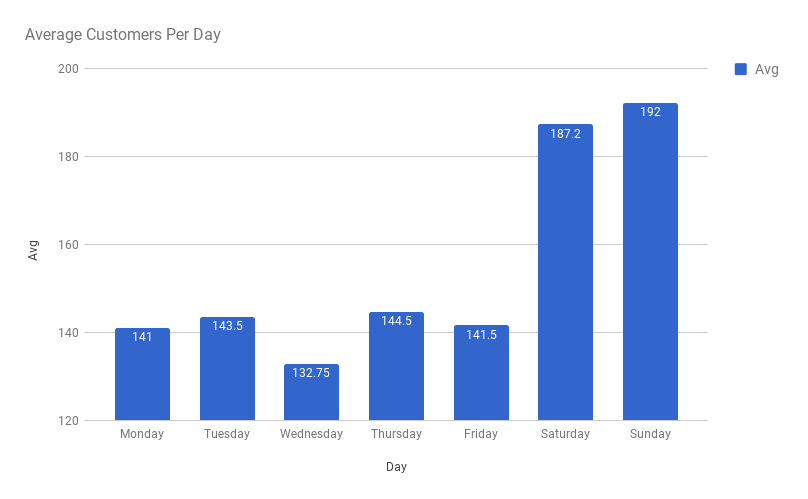
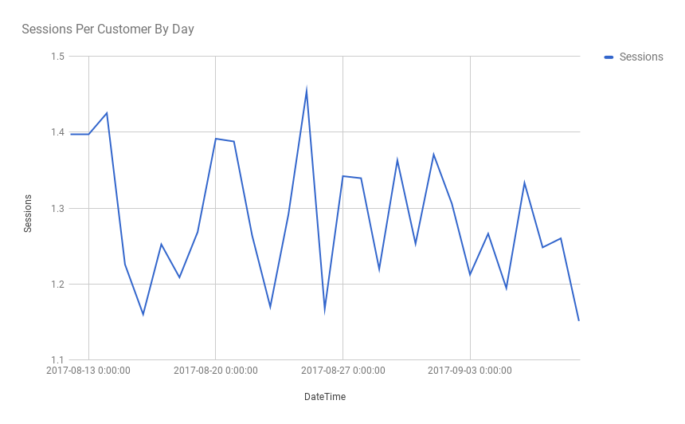
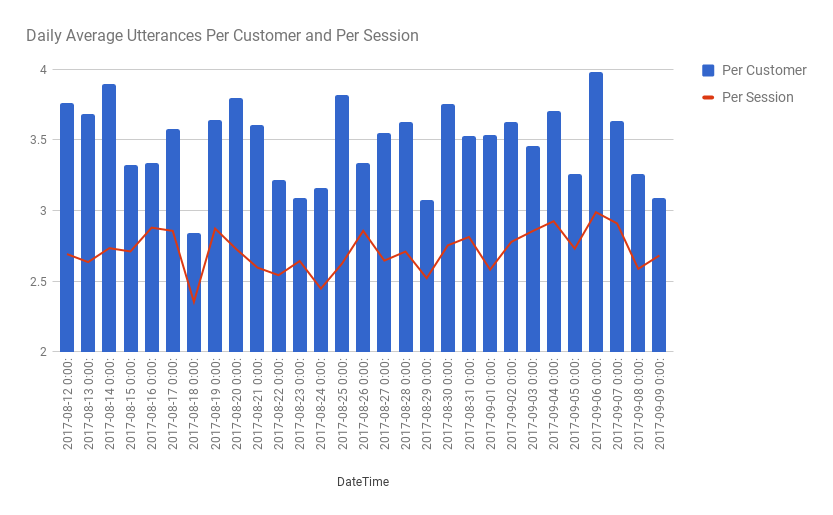
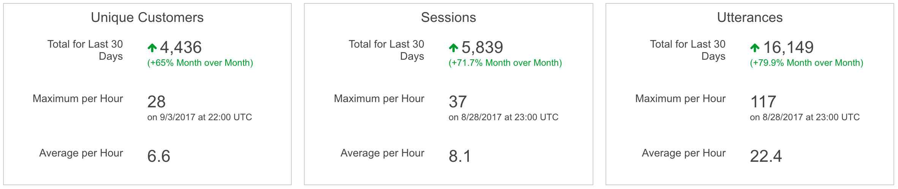

About 8 months ago I was doing some cooking and had recently purchased an Amazon Echo. I pulled out my phone to Google the safe cooking temperature for pork, something I do _literally_ every time I'm cooking any protein. My Echo is in my kitchen and I saw an opportunity; how nice and easy would it be to just ask Alexa for this information? Amazon had recently opened up the Alexa Skill Developer Kit to the public, so I took a stab at creating a simple skill to fix this problem. I published "Cook Reference" to the Skills store and it was available to the public. You can ask it the safe cooking temperatures for various meats, as well as common cooking unit conversions. In a wild stroke of luck, my skill has gained steam over the past two months, and it is now approaching 5k unique monthly users. Not only that, but Amazon is _giving me money_ now that my skill has gained popularity. It's amazing! Amazon also keeps track of multiple metrics related to the usage of your skill, and I've been glued to them over the past month. I decided to take a deeper dive into the data and I've discovered some interesting trends about how people are using Cook Reference.

I collected the data over the past 30 days, where my skill has been getting new record usage. First I asked myself a simple question: what day of the week are people cooking the most? This one was easy. I took the average number of unique customers, per day of the week, over the 30 day period and the results were obvious.

People are cooking more on the weekends! We can clearly see that Cook Reference averages between 40 and 50 more users on the weekends. This makes sense, cooking on weeknights can be tough. Overall, the skill is averaging about 155 customers per day.

Next lets look at what time of day people are using the skill. This is a graph of total unique customers over the 30 day period, aggregated hourly. Here we notice a clear pattern of spikes, with 30 spikes in total.

Each day there is a clear spike between 22:00 UTC and 1:00 UTC, which equates to between 5pm and 8pm CST. This also makes sense! _Most_ users are using my skill while they're cooking dinner in the evening. The echo is an item that is mostly available to the working class, which is consistent with the fact that the most usage occurs when people are home from work. There are a few _extra_ big spikes in this graph, but they don't seem to be correlated with my data earlier about how more people are using the skill on weekends. These spikes are randomly scattered across weekdays.

We'll also take a quick look at whether or not users are using the skill multiple times. Here is the average number of sessions customer, over the 30 days, aggregated daily. A session is defined by Amazon as an instance when the skill is launched, but not necessarily how many times users are asking questions of the skill.

Nothing too crazy here. The spikes are right around that evening usage time, and we can see that users are averaging just under 1.5 sessions per day.

To Add to that data, we can look at how many "utterances" are occurring per customer, per day. An "utterance" is defined as an actual request from a user. A user can start a single session and then ask multiple utterances from a skill. Also included in this graph is average utterances per user session.

We can see a fairly consistent graph here, where users are asking between 3 and 4 questions of the skill each time they use it. This is interesting to me, since it seems unlikely that someone would need to know the safe temperature for two different proteins during the cooking of a single meal. But who knows! Maybe I need to step up my cooking game and cook two different meats for a single meal. Maybe this data is telling me that I need to become a better cook :P

So there you have it. There are some cool things we can learn from Cook Reference's usage data. Most of it isn't too surprising, people are cooking at night and on the weekends, and they're concerned about the safety of their proteins. Maybe I'll make another post down the line if the growth continues and there is more data for us to go through.

I'll leave you with a quick snap of the overview from the past 30 days. So cool to see real people making a thing you made! :)

